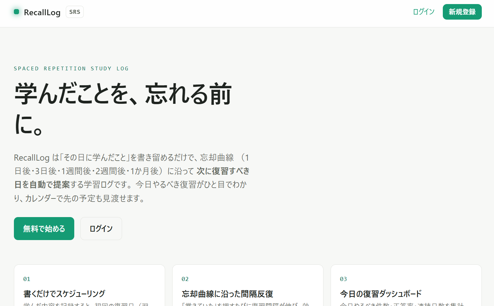
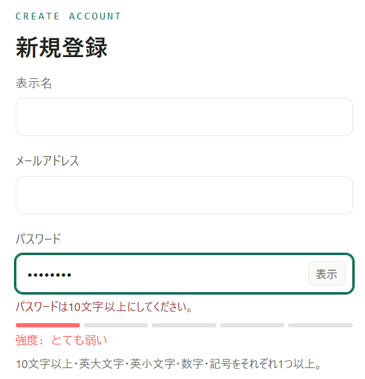
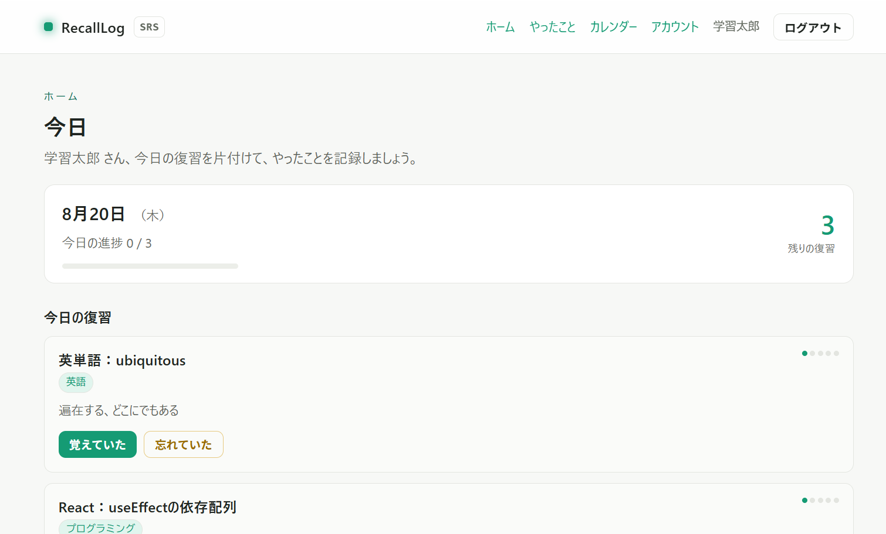
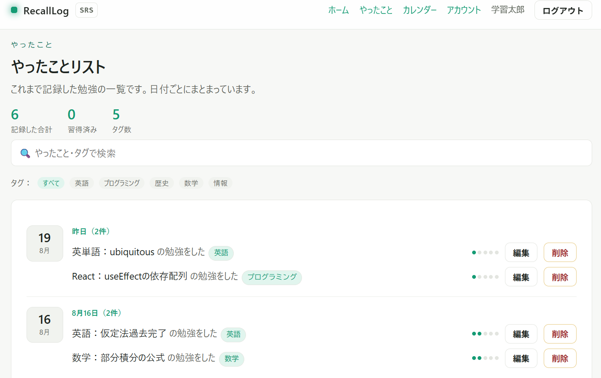
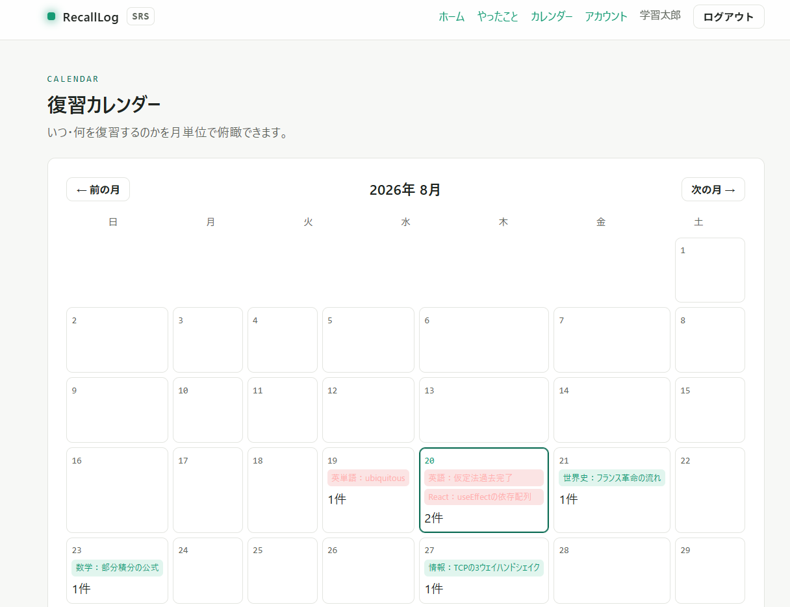
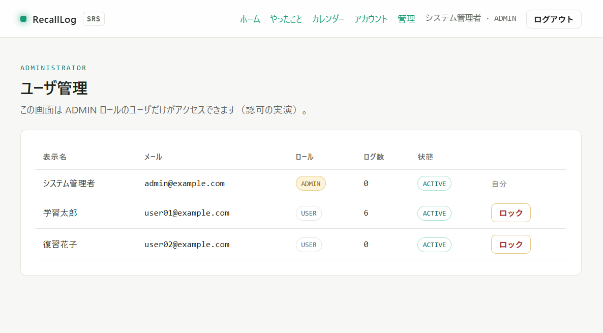

# RecallLog

**学んだことを記録すると、忘却曲線に沿って「次にいつ復習すればいいか」を自動で管理してくれる学習ログアプリです。**

編入試験の勉強をしている中で、「今日は何を勉強したか」「あの範囲はいつ復習すべきか」を
自分の頭とノートだけで管理するのに限界を感じたのが、このアプリを作ったきっかけです。
毎日の学習を書き留めるだけで、復習のタイミングを勝手に組み立ててくれる——
そういう相棒がほしくて作りました。

学習の記録は「自分だけのもの」です。だからこそ、**本人だけが自分の記録にアクセスできる**
という認証・認可を、このアプリの土台としてしっかり作り込んでいます。

---

## 何ができるのか

- **勉強したことをまとめて記録する** — ホームの記録欄に、1行に1つずつ書いて一括登録できる。行ごとにタグも付けられる
- **復習日を自動で決めてくれる** — 記録すると、忘却曲線に沿って次の復習日が自動でセットされる
- **今日やる復習がホームですぐ片付く** — 「覚えていた / 忘れていた」を押すだけ。結果に応じて次回の復習日が調整される
- **やったことを振り返れる** — 「やったこと」ページで、過去の記録を日付ごとにまとめて確認・検索・タグ絞り込みできる
- **カレンダーで先の予定を見渡せる** — いつ・何を復習するかを月表示で確認できる（やり忘れは赤で表示）
- **アカウント管理** — パスワード変更、ログイン履歴の確認

---

## 画面構成

| 画面 | パス | 内容 |
| ---- | ---- | ---- |
| ホーム | `/member/dashboard` | 今日の日付・進捗、今日の復習、勉強の記録（一括登録） |
| やったこと | `/member/records` | 過去の記録を日付ごとに一覧・検索・タグ絞り込み |
| カレンダー | `/member/calendar` | 復習予定を月表示で俯瞰 |
| アカウント | `/member/account` | パスワード変更・ログイン履歴 |

---

## 忘却曲線にどう沿っているか

人の記憶は時間とともに薄れますが、**忘れかけた頃に復習を繰り返す**と定着が一気に良くなります。
これを「間隔反復（Spaced Repetition）」と呼びます。RecallLog はこの考え方を素直に実装しています。

学習を記録すると、次の間隔で復習日が組まれていきます。

```
学習 → 1日後 → 3日後 → 7日後 → 14日後 → 30日後 →（習得済み）
```

復習のときの操作はシンプルに 2 択です。

- **覚えていた** → 段階が 1 つ進み、次の復習が先に延びる。最後まで到達すると「習得済み」になる
- **忘れていた** → 段階が 1 つ戻り、翌日にもう一度出てくる

この間隔は将来自分で調整したくなると思ったので、`src/libs/srs.ts` に定数として切り出し、
復習日の計算ロジックもそこに集約しています。

---

## 認証・認可の設計

このアプリの中心的なテーマは、**学習記録を本人だけのものとして安全に守ること**です。
そのために、認証（あなたが誰か）と認可（あなたに何が許されているか）を次のように実装しています。

### 採用した認証方式：トークンベース認証（JWT）と、その理由

セッション方式ではなく **JWT（トークンベース認証）** を採用しています。
JWT は署名を検証するだけで認証・認可が完結する（毎回 DB を引かなくてよい）ため、
本アプリでもユーザー情報の取得や管理者判定を **トークンの署名検証のみ** で行っています
（`src/app/api/_helper/jwt.ts` / `verifyAuth.ts`）。

一方で、JWT を LocalStorage に保存すると XSS で流出しやすいという弱点があります。
LocalStorage には `HttpOnly` のような保護機構がなく、XSS が成立すると JavaScript から
トークンを盗み出せてしまうためです。そこで本アプリは **JWT を LocalStorage ではなく
HttpOnly Cookie に載せる** 構成にし、JWT の利点と Cookie の XSS 耐性を両立しています
（`src/app/api/_helper/cookies.ts`）。

Cookie には次の属性を付与しています。

| 属性 | 値 | 目的 |
| ---- | -- | ---- |
| `HttpOnly` | true | JavaScript から読めない → XSS でのトークン流出を防ぐ |
| `Secure` | 本番で true | HTTPS 通信でのみ送信する |
| `SameSite` | `Strict` | 他サイト起点のリクエストに Cookie を付けない → CSRF 対策 |
| `Max-Age` | 短命 | アクセストークンは 15 分で失効させる |

### 追加で実装した認証・認可の機能

基本的なログイン／ログアウトに加えて、認証・認可に関わる機能を複数実装しています。

1. **パスワード強度メーター ＋ 厳格なポリシー ＋ 確認用パスワード**
   サインアップ・パスワード変更で強度を4段階表示。`zod` と正規表現で「10文字以上・
   英大文字・小文字・数字・記号を各1つ以上」を必須にし、確認用との一致も検証。
   この検証は **クライアントとサーバの両方** で行う
   （`src/libs/passwordStrength.ts` / `src/app/_types/index.ts`）。

2. **パスワード表示切替 ＋ メール重複のリアルタイムチェック**
   入力ミスを防ぐ表示トグルと、サインアップ時にメールの使用可否を即時表示
   （`src/app/_components/PasswordField.tsx` / `src/app/_actions/signup.ts`）。

3. **ログイン試行のレートリミット ＋ ログイン履歴**
   直近10分で5回失敗すると一時的に拒否し、総当たりを抑止。全試行を記録して判定する。
   ログイン成功時は日時・IP・User-Agent を記録し、本人がアカウント画面で確認できる
   （`src/app/api/login/route.ts` / `src/config/auth.ts`）。

4. **管理者ロールによる認可 ＋ サイレントリフレッシュ**
   ADMIN ロールのユーザーだけがアクセスできる管理画面で、全ユーザーの一覧と
   アカウントのロック／解除ができる（認可の実演）。ロックされたユーザーはログインできない。
   また、15分で切れるアクセストークンを、有効なリフレッシュトークン（7日）で
   再ログインなしに自動更新する
   （`src/app/_hooks/apiFetch.ts` / `src/app/api/refresh/route.ts` / `src/app/admin/`）。

### 認可（本人のデータだけ操作できる仕組み）

学習ログの取得・編集・削除・復習では、対象データの `userId` がログイン中ユーザーと
一致することを **必ず確認** してから実行します。これを怠ると、ID を差し替えるだけで
他人のデータを操作できてしまう **IDOR（Insecure Direct Object Reference）** 脆弱性が
生まれます（`src/app/api/study-logs/[id]/route.ts` ほか）。
管理者専用 API は `verifyAdmin` でロールを検証します。画面側のガードは UX のためのもので、
**本質的な保護はサーバ側の API で行っています**。

### その他のセキュリティ対策

- パスワードは **bcrypt** でハッシュ化して保存し、平文は一切残さない（ソルト内包）
- ログイン時、ユーザーが存在しない場合でも **ダミーのハッシュと比較** し、応答時間の差で
  アカウントの存在を推測されないようにする（タイミング攻撃・ユーザー列挙への配慮）
- 復習結果の記録と学習ログの更新は **トランザクション** で実行し、不整合を防ぐ
- `middleware.ts` でリクエストごとの nonce を用いた **Content-Security-Policy** を付与し、
  XSS の影響を抑える。あわせて `X-Frame-Options` などのセキュリティヘッダも設定
- JWT の署名鍵は環境変数（`JWT_SECRET`）からのみ取得し、ソースに直書きしない

---

## 使っている技術

いつでもどこからでも（スマホでもPCでも）使えることを最優先に、次の構成を選びました。

- **Next.js（App Router）/ React / TypeScript** — フロントとAPIを一つのコードベースでまとめられるため
- **Prisma + PostgreSQL** — 型安全にDBを扱えて、無料のクラウドPostgres（Neon）でそのまま公開できるため
- **jose（JWT）/ bcryptjs** — 認証とパスワード保護を自前で堅く実装するため
- **zod + react-hook-form** — 入力チェックをクライアントとサーバの両方で揃えるため

---

## ローカルで動かす

### 必要なもの

- Node.js 18 以上
- 無料のPostgreSQL（[Neon](https://neon.tech) など）

### 手順

```bash
# 1. 依存パッケージをインストール
npm install

# 2. 環境変数を用意
cp .env.example .env
#   DATABASE_URL … Neon で作った接続文字列を貼る
#   JWT_SECRET   … 16文字以上のランダムな文字列（例: openssl rand -base64 32）

# 3. データベースにテーブルを作成
npm run db:push

# 4. 初期データ（サンプルの学習ログ入りアカウント）を投入
npm run seed

# 5. 起動
npm run dev
```

<http://localhost:3000> を開き、下のアカウントでログインすると、
サンプルの学習ログが入った状態でホームを試せます。

| メールアドレス | パスワード | 備考 |
| -------------- | ---------- | ---- |
| `user01@example.com` | `User01#Passw0rd` | サンプルの記録入り（今日の復習あり） |
| `user02@example.com` | `User02#Passw0rd` | データが本人ごとに分離されていることの確認用 |
| `admin@example.com` | `Admin#Passw0rd` | 管理用アカウント（ユーザー管理画面の確認用） |

> `user01` でログインしたあと、`user02` の記録が一切見えないことを確認すると、
> 認可（本人のデータのみアクセス可能）が働いていることを確認できます。

> `.env` は秘密情報を含むためリポジトリに含めていません（`.gitignore` で除外）。
> 配布しているのは `.env.example` のみです。

---

## 公開する（Vercel + Neon）

いつでもアクセスできるように、Vercel にデプロイして本番URLを立てられます。

1. **Neon でデータベースを用意する**
   [neon.tech](https://neon.tech) でプロジェクトを作成し、接続文字列
   （`postgresql://...?sslmode=require`）を控える。

2. **GitHub にこのコードを push する。**

3. **Vercel にインポートする**
   [vercel.com](https://vercel.com) で「New Project」からリポジトリを選び、環境変数に
   `DATABASE_URL`（Neon の接続文字列）と `JWT_SECRET`（16文字以上のランダムな文字列）を設定する。

4. **デプロイ後、初回だけ本番DBにテーブルを作成する。**
   ```bash
   # .env の DATABASE_URL を本番用にした状態で
   npm run db:push
   npm run seed   # 初期アカウントが不要なら省略可
   ```

> ビルド時に `prisma generate` が自動実行されるよう設定してあるので、
> Vercel 側での追加設定は基本的に不要です。

---

## 画面キャプチャ

> スクリーンショットは `docs/images/` に置いています。

### トップ



### サインアップ（パスワード強度メーターなど）



### ホーム（今日の復習＋勉強の記録）



### やったこと（日付ごとの一覧）



### カレンダー（復習予定の俯瞰）



### 管理者によるユーザー管理（ADMIN 専用）



---

## ディレクトリ構成

```
recalllog/
├─ prisma/
│  ├─ schema.prisma        # User / StudyLog / Review / LoginAttempt / LoginHistory
│  └─ seed.ts              # 初期アカウント＋サンプル学習ログ
├─ src/
│  ├─ middleware.ts        # nonce 付き CSP などのセキュリティヘッダ
│  ├─ config/auth.ts       # 認証・レートリミットの設定値
│  ├─ libs/
│  │  ├─ prisma.ts         # PrismaClient（サーバレス対応のシングルトン）
│  │  ├─ passwordStrength.ts  # パスワード強度の評価
│  │  └─ srs.ts            # 忘却曲線（間隔反復）の計算ロジック
│  └─ app/
│     ├─ _types/           # zod スキーマ・型定義
│     ├─ _actions/         # サインアップ（Server Actions）
│     ├─ _contexts/        # ログイン状態の管理（自動トークン更新）
│     ├─ _hooks/           # 認証付き fetch
│     ├─ _components/      # Header / PasswordField / StrengthMeter
│     ├─ api/
│     │  ├─ _helper/       # jwt / cookies / verifyAuth（認証・認可の中核）
│     │  ├─ login, logout, refresh, me, password, login-history
│     │  ├─ study-logs, study-logs/[id], study-logs/[id]/review, study-logs/bulk
│     │  ├─ calendar       # 復習カレンダー
│     │  └─ admin/users, admin/users/[id]/lock  # 管理者専用
│     ├─ login, signup
│     ├─ member/           # dashboard（ホーム）/ records / calendar / account
│     └─ admin/            # 管理者エリア（ADMIN 専用）
└─ next.config.ts          # セキュリティヘッダ
```

---

## これから足したいこと

- 復習間隔を自分好みに設定できるようにする（今は固定の 1・3・7・14・30 日）
- 「今日の復習があります」をメールやプッシュで通知する
- 学習時間や連続日数（ストリーク）の記録
- 記憶度に応じて間隔を動的に変える方式（SM-2 など）への発展

---

## 作業時間

10時間